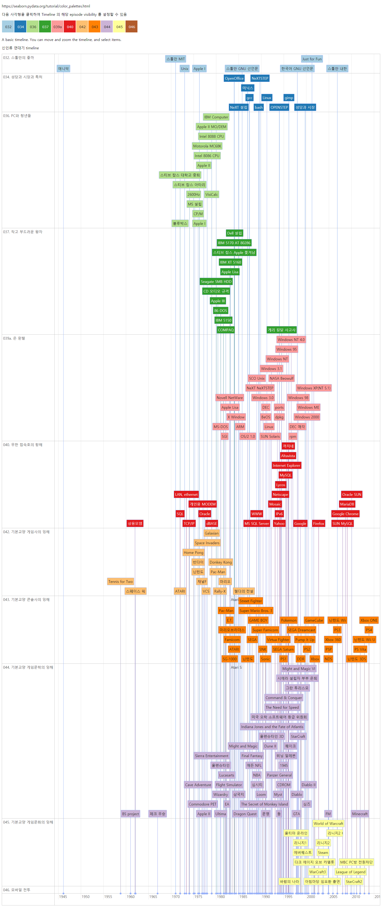

# 신인류 연대기

## 내가 이 에피소드를 정리하는 이유

* 딴지라디오 "그것은 알기 싫다" 라는 팟캐스트 중 open source software 의 역사를 다룬 에피소드
* ~~3년간 위험한 spindle, resin 등의 발암물질, 1000도의 furnace 앞에서 주80시간 일하던~~ 내가 이직을 결심하게 만든 이야기
* 역사를 배우는 이유는 현재와 미래를 알기 위해
  * 과거 IT 역사를 알다 보면 현재와 미래가 보이지 않을까

## 에피소드 목록

* [032. 스톨만의 좋까](https://soundcloud.com/ddanzi/u-32?in=wanderatdawn/sets/ddanzi-xsfm)
* [034. 성당과 시장과 특허](https://soundcloud.com/ddanzi/u-34?in=wanderatdawn/sets/ddanzi-xsfm)
* [036. PC와 청년들](https://soundcloud.com/ddanzi/u-36?in=wanderatdawn/sets/ddanzi-xsfm)
* [037. 작고 부드러운 왕자](https://soundcloud.com/ddanzi/u-37?in=wanderatdawn/sets/ddanzi-xsfm)
* [039a. 은 윈텔](https://soundcloud.com/ddanzi/u-39?in=wanderatdawn/sets/ddanzi-xsfm)
* [040. 무한 접속호의 항해](https://soundcloud.com/ddanzi/u-40?in=wanderatdawn/sets/ddanzi-xsfm)
* [042. 기본교양 게임사의 잉해](https://soundcloud.com/ddanzi/u-42?in=wanderatdawn/sets/ddanzi-xsfm)
* [043. 기본교양 콘솔사의 잉해](https://soundcloud.com/ddanzi/u-43?in=wanderatdawn/sets/ddanzi-xsfm)
* [044. 기본교양 게임문학의 잉해](https://soundcloud.com/ddanzi/u-44?in=wanderatdawn/sets/ddanzi-xsfm)
* [045. 기본교양 게임문화의 잉해](https://soundcloud.com/ddanzi/u-45?in=wanderatdawn/sets/ddanzi-xsfm)
* [046. 신인류 연대기:모바일 전투](https://soundcloud.com/ddanzi/u-46?in=wanderatdawn/sets/ddanzi-xsfm)

## Timeline

